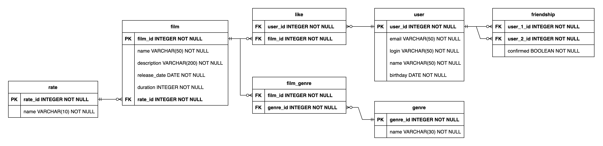

# Filmorate

## Endpoints

### Films
- `[GET] /films` – getting all films
- `[GET] /films/{id}` – getting film by id
- `[POST] /films` – creating of new film
- `[PUT] /films` – updating of film
- `[DELETE] /films` – deleting of film
- `[GET] /films/popular?count={count}` – getting `count` of the most popular films
- `[PUT] /films/{id}/like/{userId}` – like film with id = `id` by user with id = `userId`
- `[DELETE] /films/{id}/like/{userId}` – delete like from film with id = `id` by user with id = `userId`

### Users
- `[GET] /users` – getting all users
- `[GET] /users/{id}` – getting user by id
- `[POST] /users` – creating of new user
- `[PUT] /users` – updating of user
- `[DELETE] /users` – deleting of user
- `[PUT] /users/{id}/friends/{friendId}` – make friends two users
- `[DELETE] /users/{id}/friends/{friendId}` – stop friendship of two users
- `[GET] /users/{id}/friends` – get all friends of user
- `[GET] /users/{id}/friends/common/{otherId}` – get common friends of two users

## Database scheme

